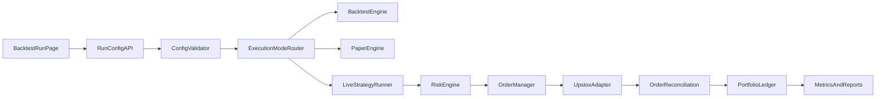

# Indian F&O Algo Platform Implementation Plan

## Objective
Build a production-lean architecture for `backtest + paper + live` execution with shared strategy parameter contracts, strict risk controls, and an operator-friendly UI.

## What to Build First (MVP scope)
- Unified strategy parameter schema and validation shared across backend/frontend.
- Execution modes: `backtest`, `paper`, `live` with same strategy contract.
- Risk engine: position sizing, per-trade risk, max drawdown, exposure limits, kill switch.
- Order lifecycle service: submit, acknowledge, partial fill, complete/reject, reconcile.
- F&O-aware config: lot size, contract selection, expiry/roll rules, product type.

## Current Codebase Baseline (from repo)
- Strategy params are currently untyped map in [`server/modules/strategy/types.ts`](server/modules/strategy/types.ts): `params: Record<string, number>`.
- Backtest config also uses untyped params in [`server/modules/backtest/types.ts`](server/modules/backtest/types.ts).
- Frontend API and form mirror same weak typing in [`client/src/lib/api.ts`](client/src/lib/api.ts) and [`client/src/pages/BacktestPage.tsx`](client/src/pages/BacktestPage.tsx).
- Orders/risk runtime modules are missing as first-class domains (API passthrough exists, but not a full internal state machine).

## Required Parameter Interface (target contract)
Create shared contract in new file: [`shared/contracts/strategy-params.ts`](shared/contracts/strategy-params.ts)

```ts
export type ParamPrimitive = "number" | "integer" | "boolean" | "enum" | "string";

export interface StrategyParamSpec {
  key: string;
  label: string;
  type: ParamPrimitive;
  required: boolean;
  defaultValue?: number | boolean | string;
  min?: number;
  max?: number;
  step?: number;
  options?: Array<{ label: string; value: string }>;
  description?: string;
  group?: "signal" | "risk" | "execution" | "fo_contract";
}

export interface RiskLimits {
  maxDailyLossPct: number;
  maxOpenPositions: number;
  maxCapitalPerTradePct: number;
  maxStrategyDrawdownPct: number;
  maxOrdersPerMinute: number;
  killSwitchEnabled: boolean;
}

export interface FoContractConfig {
  underlying: string;
  instrumentType: "FUT" | "CE" | "PE";
  expiryPolicy: "nearest" | "next" | "weekly" | "monthly";
  strikeSelection?: "atm" | "itm" | "otm" | "delta";
  lotMultiplier: number;
}

export interface StrategyRunConfig {
  mode: "backtest" | "paper" | "live";
  strategyName: string;
  instrumentKey: string;
  interval: "1m" | "5m" | "15m" | "1h" | "1d";
  from?: string;
  to?: string;
  initialBalance: number;
  params: Record<string, number | boolean | string>;
  risk: RiskLimits;
  fo: FoContractConfig;
}
```

## Architecture Shape (target)


## Agent-by-Agent Execution Plan

### Agent 1 — Contracts & Validation
- **Files**
  - Add [`shared/contracts/strategy-params.ts`](shared/contracts/strategy-params.ts)
  - Update [`server/modules/strategy/types.ts`](server/modules/strategy/types.ts)
  - Update [`server/modules/backtest/types.ts`](server/modules/backtest/types.ts)
  - Update [`client/src/lib/api.ts`](client/src/lib/api.ts)
- **Tasks**
  - Replace `Record<string, number>` with schema-driven params.
  - Add runtime validation for `StrategyRunConfig` at API boundary.
  - Ensure default param hydration for missing optional values.
- **Done when**
  - Invalid configs fail fast with actionable messages.
  - FE/BE compile against one shared contract.

### Agent 2 — Strategy Registry & Metadata
- **Files**
  - Update [`server/modules/strategy/registry.ts`](server/modules/strategy/registry.ts)
  - Update strategy definitions under [`server/modules/strategy/strategies`](server/modules/strategy/strategies)
- **Tasks**
  - Registry returns `paramSpecs`, `description`, supported intervals, supported modes.
  - Strategy-specific constraints (e.g., `fastPeriod < slowPeriod`).
- **Done when**
  - `/api/v1/strategies` can fully drive dynamic UI form rendering.

### Agent 3 — Risk Engine
- **Files**
  - Add [`server/modules/risk/index.ts`](server/modules/risk/index.ts)
  - Add [`server/modules/risk/types.ts`](server/modules/risk/types.ts)
  - Wire from run pipeline in [`server/index.ts`](server/index.ts) and relevant API route.
- **Tasks**
  - Pre-trade checks: quantity caps, loss caps, max exposure, order rate guard.
  - Runtime checks: daily loss, drawdown breach, kill switch.
  - Return structured reject reason codes.
- **Done when**
  - Paper/live orders cannot bypass risk checks.

### Agent 4 — Execution Layer (Paper + Live)
- **Files**
  - Add [`server/modules/execution/runner.ts`](server/modules/execution/runner.ts)
  - Add [`server/modules/execution/order-manager.ts`](server/modules/execution/order-manager.ts)
  - Add [`server/modules/execution/paper-engine.ts`](server/modules/execution/paper-engine.ts)
  - Reuse [`server/shared/upstox.ts`](server/shared/upstox.ts)
- **Tasks**
  - Common strategy runner dispatching by mode.
  - Paper fill model with slippage/fees assumptions and partial fills.
  - Live order submit + reconciliation loop.
- **Done when**
  - Same strategy can run in all modes with deterministic mode-specific behavior.

### Agent 5 — F&O Contract Resolver
- **Files**
  - Add [`server/modules/options/contract-resolver.ts`](server/modules/options/contract-resolver.ts)
  - Integrate with existing options API route(s).
- **Tasks**
  - Resolve tradable contract from `FoContractConfig` (expiry/strike policy).
  - Enforce lot size normalization before order creation.
  - Support rollover policy for expiring contracts.
- **Done when**
  - Order request always carries resolved contract + valid lot quantity.

### Agent 6 — UI Configuration Interface
- **Files**
  - Update [`client/src/pages/BacktestPage.tsx`](client/src/pages/BacktestPage.tsx)
  - Add [`client/src/components/strategy/RunConfigForm.tsx`](client/src/components/strategy/RunConfigForm.tsx)
  - Update query layer [`client/src/lib/backtest-queries.ts`](client/src/lib/backtest-queries.ts)
- **Tasks**
  - Add mode selector (`backtest/paper/live`).
  - Generate form from `paramSpecs` with min/max/step/options help text.
  - Add risk controls and F&O contract config sections.
  - Add pre-submit validation and guardrail warnings.
- **Done when**
  - Operator can run any strategy from one form without manual JSON editing.

### Agent 7 — Persistence, Telemetry, and Ops
- **Files**
  - Add DB accessors under new module folders (risk/execution).
  - Extend existing backtest run storage as needed.
- **Tasks**
  - Persist run configs, risk breaches, order lifecycle events, and mode-specific metrics.
  - Add structured logs and error codes for retries/alerting.
- **Done when**
  - A failed order/risk rejection is debuggable from DB/log trail.

### Agent 8 — Test & Verification Agent
- **Files**
  - Add tests under `server/modules/**/__tests__` and `client/src/**/__tests__`.
- **Tasks**
  - Contract tests for shared schema.
  - Risk policy unit tests.
  - Paper/live parity integration tests (same signals, expected divergence only in fills).
  - UI form generation tests from strategy metadata.
- **Done when**
  - CI covers critical risk + execution flows and rejects unsafe regressions.

## Industry Patterns to Copy (why this plan)
- QuantConnect LEAN separates algorithm parameters, optimization, and pluggable risk models; this validates explicit param schemas and modular risk stage design. [Parameters - QuantConnect.com](https://www.quantconnect.com/docs/v2/lean-cli/optimization/parameters), [Key Concepts - QuantConnect.com](https://www.quantconnect.com/docs/v2/writing-algorithms/algorithm-framework/risk-management/key-concepts)
- Freqtrade shows config-driven risk controls (`stoploss`, `max_open_trades`, dynamic stake sizing), supporting strongly-typed run config with risk fields. [Configuration - Freqtrade](https://docs.freqtrade.io/en/2026.3/configuration/), [Stoploss - Freqtrade](https://www.freqtrade.io/en/stable/stoploss/)
- Hummingbot uses modular architecture (strategy/controller + executor + connector + order tracking), aligning with runner/order-manager split. [Architecture - Hummingbot](https://docs.hummingbot.org/strategies/v2-strategies/), [Connector Architecture - Hummingbot](https://hummingbot.org/connectors/connectors/architecture/)
- Alpaca emphasizes paper/live API parity and explicit simulation assumptions, guiding paper-engine realism notes. [Paper Trading](https://docs.alpaca.markets/docs/paper-trading), [Placing Orders](https://docs.alpaca.markets/docs/orders-at-alpaca)
- Zerodha/Kite constraints (order and websocket limits) require platform-level throttling + websocket-first market data ingestion. [Exceptions and errors - Kite Connect 3 / API documentation](https://kite.trade/docs/connect/v3/exceptions/), [WebSocket streaming - Kite Connect 3 / API documentation](https://kite.trade/docs/connect/v3/websocket/)

## Rollout Sequence
1. Shared contracts + validation.
2. Strategy metadata + UI generation.
3. Risk engine and rejection taxonomy.
4. Paper engine and order manager.
5. Live mode integration + reconciliation.
6. F&O resolver and lot/expiry policies.
7. Persistence + observability.
8. Full test pass and staged activation (backtest → paper soak → constrained live).

## Risks and Mitigations
- **Risk:** Overfitting from backtest optimization.
  - **Mitigation:** Walk-forward splits and out-of-sample reporting before live enablement.
- **Risk:** Paper/live behavior mismatch.
  - **Mitigation:** Explicit simulation assumptions + live shadow mode logs.
- **Risk:** API limit breaches for broker routes.
  - **Mitigation:** Global rate limiter and websocket-first updates.
- **Risk:** F&O contract mis-selection.
  - **Mitigation:** Deterministic resolver with pre-trade contract validation and manual override.

## Acceptance Criteria
- One run-config form supports backtest/paper/live with strategy, risk, and F&O settings.
- All orders (paper/live) pass through the same risk engine and order manager contracts.
- Shared param schema is single source of truth consumed by FE and BE.
- End-to-end tests cover config validation, risk rejects, order lifecycle transitions, and mode routing.

## Sources
- [Parameters - QuantConnect.com](https://www.quantconnect.com/docs/v2/lean-cli/optimization/parameters)
- [Key Concepts - QuantConnect.com](https://www.quantconnect.com/docs/v2/writing-algorithms/algorithm-framework/risk-management/key-concepts)
- [Configuration - Freqtrade](https://docs.freqtrade.io/en/2026.3/configuration/)
- [Stoploss - Freqtrade](https://www.freqtrade.io/en/stable/stoploss/)
- [Architecture - Hummingbot](https://docs.hummingbot.org/strategies/v2-strategies/)
- [Connector Architecture - Hummingbot](https://hummingbot.org/connectors/connectors/architecture/)
- [Paper Trading](https://docs.alpaca.markets/docs/paper-trading)
- [Placing Orders](https://docs.alpaca.markets/docs/orders-at-alpaca)
- [Exceptions and errors - Kite Connect 3 / API documentation](https://kite.trade/docs/connect/v3/exceptions/)
- [WebSocket streaming - Kite Connect 3 / API documentation](https://kite.trade/docs/connect/v3/websocket/)