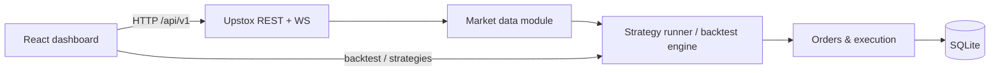

<div align="center">

# Algo Trading

**A Bun-native algorithmic trading workstation for Indian markets — Upstox OAuth, live & historical market data, strategy backtests, and a React dashboard.**

[](https://bun.sh)
[](https://www.typescriptlang.org/)
[](https://react.dev/)
[](https://vite.dev/)

[](https://github.com/Aditya1942/algo-trading)
[](https://github.com/Aditya1942/algo-trading/commits)

[Features](#-features) · [Quick start](#-quick-start) · [Architecture](#-architecture) · [API](#-api-surface) · [Docs](#-documentation) · [Roadmap](#-roadmap--future-work)

</div>

---

## Why this project?

Retail algo tooling is often split across brittle scripts, opaque broker UIs, and generic backtesters that do not match **Indian cash and F&O** workflows. This repo is a **single monorepo** where:

- **One strategy abstraction** drives backtests and (when wired) paper/live execution.
- The **server** is a modular Bun monolith with SQLite — no separate JVM or Python env for core flows.
- The **client** is a modern dashboard (shadcn-style UI, TanStack Query, Lightweight Charts) for everything from holdings to custom strategies.

It is built around the **[Upstox Developer API](https://upstox.com/developer/api-documentation/)** (OAuth2, REST, instruments, historical candles, orders, portfolio).

---

## Features

| Area | What you get |
|------|----------------|
| **Auth** | Upstox OAuth2 — visit `/auth/login`, tokens stored in SQLite with refresh |
| **Dashboard** | Portfolio-aware home view after login |
| **Holdings & orders** | Proxy routes to Upstox order book, history, multi-order, GTT, positions, exit |
| **Market data** | Track instruments, background OHLCV download worker, candle aggregation for charts |
| **Charts** | Per-instrument chart routes with historical series |
| **Instruments** | Search (Upstox) + locally cached instrument lists |
| **Backtesting** | Replay engine with built-in strategies (SMA crossover, RSI+MACD, Bollinger+volume), history API |
| **Custom strategies** | Create/list custom strategies (Monaco-powered builder UI + server persistence) |
| **Developer UX** | Typed modules, `bun test` on server, Vite HMR client, structured logging hooks |

> **Note:** Telegram alerts and a dedicated `notifications/` module appear in older design docs and `.env` examples but are **not yet implemented** in the TypeScript codebase — they remain on the [roadmap](#-roadmap--future-work).

---

## Quick start

### Prerequisites

- **[Bun](https://bun.sh)** (recommended: latest stable)
- **Upstox** developer app: `UPSTOX_CLIENT_ID` and `UPSTOX_CLIENT_SECRET`
- Optional: `TELEGRAM_*` keys in `.env` reserved for future alert integration

### 1. Clone and install

```bash
git clone https://github.com/Aditya1942/algo-trading.git
cd algo-trading
bun install
cd server && bun install && cd ../client && bun install
```

*(Or run `bun install` from `server/` and `client/` separately if you prefer.)*

### 2. Configure the server

```bash
cp server/.env.example server/.env
```

Minimum required in `server/.env`:

```env
UPSTOX_CLIENT_ID=your_client_id
UPSTOX_CLIENT_SECRET=your_client_secret
UPSTOX_REDIRECT_URI=http://localhost:8081/auth/callback
```

Bun loads `.env` automatically — no `dotenv` import.

### 3. Run client + API together

From the **repository root**:

```bash
bun run dev
```

| Service | URL | Notes |
|---------|-----|--------|
| **API** | [http://localhost:8081](http://localhost:8081) | `GET /api/v1/health` → `{ "healthy": true }` |
| **Web app** | [http://localhost:3000](http://localhost:3000) | Vite proxies `/api` and `/auth/login` to `8081` |

### 4. Connect Upstox

Open **`http://localhost:8081/auth/login`** (or use the client login flow) and complete OAuth once. Tokens persist in SQLite beside the server (`algo.db` path — see `server/shared/db.ts`).

---

## Architecture

High-level data flow (live path):



Monorepo layout:

```
algo-trading/
├── package.json          # dev, server, client, build:client
├── server/               # Bun.serve — API, trading logic, SQLite
│   ├── api/              # Thin HTTP handlers + route registration
│   ├── modules/          # auth, market-data, strategy, backtest, orders, …
│   ├── shared/           # config, db, types, Upstox client
│   └── index.ts          # Route table + download worker
├── client/               # Vite + React 19 + Tailwind 4 + TanStack Query
│   └── src/
└── docs/                 # Deep dives: strategy architecture, auth, plans
```

Design invariants (from project conventions):

- **`/api/v1/`** for JSON APIs; **OAuth callbacks** stay at **`/auth/*`** so redirect URIs stay broker-correct.
- Modules **do not** reach into each other’s internals — communication via typed calls.
- **`shared/upstox.ts`** is the single Upstox HTTP/WebSocket client.

Full specification: [`server/docs/superpowers/specs/2026-04-12-algo-trading-design.md`](server/docs/superpowers/specs/2026-04-12-algo-trading-design.md).

---

## Web dashboard

Routes (from `client/src/App.tsx`):

| Route | Purpose |
|-------|---------|
| `/login`, `/auth/callback` | Upstox OAuth |
| `/dashboard` | Main dashboard |
| `/holdings` | Holdings |
| `/orders` | Order book & activity |
| `/market-data` | Tracked instruments & data |
| `/market-data/:id/chart` | Candlestick charts |
| `/instruments` | Instrument search & cache |
| `/settings` | App settings |
| `/backtest` | Run backtests, view history |
| `/strategy-builder` | Author custom strategies |

---

## API surface

**Health**

- `GET /api/v1/health`

**OAuth (browser)**

- `GET /auth/login`, `GET /auth/callback`

**App**

- Market data: `GET|POST /api/v1/market-data/instruments`, keys, etc.
- Backtest: `POST /api/v1/backtest/run`, `GET /api/v1/backtest/history`
- Strategies: `GET /api/v1/strategies`
- Custom strategies: `GET|POST /api/v1/custom-strategies`
- Local cache: `GET /api/v1/instruments/stored`, `/count`

**Upstox proxy (examples)**

- User: `/api/v1/upstox/user/profile`, funds & margin, IP, kill switch
- Orders: place/modify/cancel (v1 & v3), book, history, trades, multi, GTT, exit positions
- Portfolio: holdings, positions, MTF, convert
- Market: quotes, OHLC, LTP, option chain, holidays, option greek (v3)
- Charges & P&amp;L: brokerage, margin, trade P&amp;L endpoints
- Feed authorisation URLs for market-data and portfolio streams
- Instruments search; expired F&amp;O contract helpers

Dynamic routes (historical candles, custom strategy assets, etc.) are registered in `server/api/*` and resolved via `matchRoute` in `server/api/_router.ts`. For the authoritative list, start from [`server/index.ts`](server/index.ts).

---

## Strategy framework

Implement `onCandle` on a registered strategy; the backtest engine replays candles and applies risk/execution logic. See [`docs/strategy-architecture.md`](docs/strategy-architecture.md) for the full pipeline (engine, indicators, persistence).

Built-in examples include **SMA crossover**, **RSI + MACD**, and **Bollinger + volume** (`server/modules/strategy/`).

---

## Testing & quality

```bash
cd server && bun test              # server unit tests
cd client && bun run lint          # ESLint
```

There is no `client` test script yet — UI tests are a [future improvement](#-roadmap--future-work).

---

## Documentation

| Document | Description |
|----------|-------------|
| [`CLAUDE.md`](CLAUDE.md) | Repo conventions, Bun-first rules, env vars |
| [`docs/strategy-architecture.md`](docs/strategy-architecture.md) | Strategy + backtest architecture |
| [`docs/upstox-auth-setup.md`](docs/upstox-auth-setup.md) | OAuth setup notes |
| [`server/docs/upstox-api-agent-reference.md`](server/docs/upstox-api-agent-reference.md) | Upstox API reference notes |
| [`docs/superpowers/plans/`](docs/superpowers/plans/) | Implementation plans (F&amp;O platform, instruments cache, …) |

---

## Roadmap & future work

Planned and in-progress themes (from internal plans and code comments):

- **Execution &amp; risk**: Typed strategy params, validation, risk engine, slippage/fees, stronger paper/live parity — see [`docs/superpowers/plans/indian-f-o-algo-platform-strategy-refactor-execution-infrastructure.md`](docs/superpowers/plans/indian-f-o-algo-platform-strategy-refactor-execution-infrastructure.md).
- **F&amp;O**: Contract resolution, lot sizing, and strategy modes beyond equity.
- **Notifications**: Telegram (or similar) for fills and risk events — env placeholders exist; implementation pending.
- **Ops**: CI (lint + test), container images, VPS deployment runbooks.
- **Client**: Automated tests (Vitest / Playwright), broader coverage of edge cases.

---

## Star history

<picture>
  <source media="(prefers-color-scheme: dark)" srcset="https://api.star-history.com/svg?repos=Aditya1942/algo-trading&type=Date&theme=dark" />
  <source media="(prefers-color-scheme: light)" srcset="https://api.star-history.com/svg?repos=Aditya1942/algo-trading&type=Date" />
  
</picture>

---

## Acknowledgments

- [Upstox](https://upstox.com/) for broker APIs  
- [Bun](https://bun.sh) for runtime, bundling, and tests  
- UI stack: React, Vite, Tailwind, Radix/shadcn patterns, Lightweight Charts, Monaco Editor  

README structure inspired by common open-source practice: clear value proposition, badges, quick start, feature tables, and deep links to docs (see e.g. [GitHub README best practices](https://dev.to/iris1031/github-readme-best-practices-how-to-write-a-readme-that-gets-stars-2gb2), [README template patterns](https://github.com/othneildrew/Best-README-Template)).

---

<div align="center">

**Built for learning and serious experimentation — not financial advice. Trading involves risk.**

</div>
